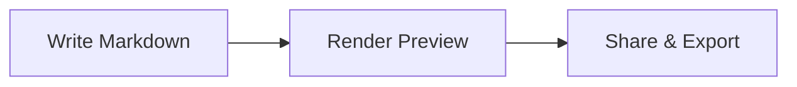

NoteApp

A modern, serverless markdown note-taking app — built for speed, privacy, and power.

NoteApp runs entirely in your browser. Your notes are stored locally in [IndexedDB](https://developer.mozilla.org/en-US/docs/Web/API/IndexedDB_API) — no servers, no accounts, no tracking. Install it as a PWA and use it offline.

---

## Features

### Editor
- **CodeMirror 6** — Modern code editor with markdown syntax highlighting and OneDark theme
- **Rich toolbar** — 16+ formatting buttons: headings, bold, italic, strikethrough, code, links, images, lists, tables, blockquotes, horizontal rules, undo/redo
- **GitHub-style shortcuts** — `Ctrl+B` bold, `Ctrl+I` italic, `Ctrl+K` link, `Ctrl+E` code, `Ctrl+S` save, and more
- **Paste-as-Markdown** — Rich HTML from webpages is automatically converted to clean Markdown
- **Image support** — Paste, drag-and-drop, or upload images; stored as blobs in IndexedDB
- **Auto-close brackets** — Quotes, brackets, and backticks auto-pair
- **Autosave** — Toggleable 3-second debounced autosave with status indicator
- **Split preview** — Resizable side-by-side editor and rendered preview
- **Inline preview** — Full rendered preview toggle
- **Word & character count** — Live counters in the status bar
- **Unsaved changes guard** — Save/Discard/Keep Editing dialog when navigating away

### Rendering
- **GitHub Flavored Markdown** — Tables, task lists, strikethrough, emoji shortcodes
- **Mermaid diagrams** — Flowcharts, sequence diagrams, Gantt charts, class diagrams, state diagrams, pie charts, mindmaps, timelines, and more
- **Syntax highlighting** — Code blocks with language-aware coloring via highlight.js (GitHub Dark theme in dark mode)
- **Anchor navigation** — Click any heading link to scroll smoothly; URL updates to reflect position
- **Copy code blocks** — One-click copy button on every code block (excluded from text selection)

### Tags & Intelligence
- **Tags** — Add, remove, and display tags as badges on notes
- **Tag search** — Filter notes by tag with `tag:` prefix
- **Smart tag suggestions** — AI-powered tag extraction from note content using 30 topic categories and 400+ keywords covering GitHub support, dev engineering, and tech domains
- **Tech pattern recognition** — Detects code languages from fenced blocks, CamelCase/snake_case splitting, heading word extraction, and frequency-based ranking

### Organization
- **Pin notes** — Pin important notes to the top (max 10 per workspace); click or drag-to-pin
- **Pinned section** — Only visible when pinned notes exist; drag notes between sections to pin/unpin
- **Sort** — By title (A-Z, Z-A), created date, modified date, or manual drag-to-reorder
- **Full-text search** — Toggleable search bar searches title, body, and tags with `title:`, `body:`, `tag:` scope prefixes
- **Note metadata** — Created and modified timestamps displayed on each note
- **Drag & drop reorder** — Manual ordering with visual drag handles and drop zone feedback
- **Keyboard navigation** — Arrow keys, Enter, Space to navigate and select notes in the list

### Workspaces
- **Multiple databases** — Create isolated workspaces (Work, Personal, etc.) with separate IndexedDB stores
- **Switch workspaces** — Modal workspace switcher showing all workspaces with active indicator
- **Rename & delete** — Manage workspace names; deleting switches to Default automatically
- **Move notes** — Move a note from one workspace to another via toolbar button

### Archive
- **Archive instead of delete** — Choose to archive notes rather than permanently delete them
- **Archive view** — Toggle archive mode in the sidebar to browse archived notes
- **Restore notes** — Restore archived notes back to their original workspace
- **Permanent delete** — Remove archived notes forever
- **Archive metadata** — Tracks source workspace and archive timestamp

### Table Converter
- **6 formats** — Convert between CSV, TSV, Markdown, HTML, SQL, and JSON
- **Auto-detect** — Automatically identifies the input table format
- **Full-page mode** — Dedicated table converter view toggled from the sidebar
- **Editor modal** — Quick-convert tables inline while editing a note
- **Format tabs** — Switch output format with tab buttons
- **Smart parsing** — Quote-aware CSV, pipe-delimited Markdown, HTML entity decoding, SQL ASCII tables, JSON arrays of objects or arrays

### Import & Export
- **Upload** — Import single `.md` files
- **ZIP import** — Bulk import from `.zip` archives
- **ZIP backup** — Download all notes as a `.zip` archive
- **Download** — Export individual notes as `.md` files
- **Print / PDF** — Clean print layout with page-break-aware formatting

### App
- **Dark / Light mode** — Full theme toggle persisted across sessions; GitHub Dark syntax colors, OneDark editor theme
- **PWA installable** — Add to home screen on mobile or desktop
- **Offline support** — Service worker with network-first navigation and cache-first static assets
- **URL routing** — Each note has a shareable URL (`#note/my-note-title`)
- **Deep linking** — Link directly to a heading within a note (`#note/my-note/section`)
- **Browser navigation** — Back/forward buttons navigate between notes
- **Responsive** — Collapsible and resizable sidebar; drawer mode on mobile with overlay
- **Accessible** — ARIA landmarks, labels, roles, live regions, and focus management throughout
- **Error boundary** — Graceful error handling with recovery UI
- **XSS protection** — All rendered HTML sanitized with DOMPurify

### Toolbar & UI
- **Sidebar toolbar** — Grouped icon buttons with subtle dividers: views (Archive, Table Converter), tools (Search, Upload, Import, Backup), actions (Dark Mode, New Note)
- **Note view toolbar** — Copy and Edit text buttons on the left; Print, Download, Move, and Delete icons on the right
- **Collapsed sidebar** — Compact vertical icon strip with full functionality
- **Consistent visual rhythm** — Harmonized bar heights (44px primary, 36px secondary) and unified border styles

---

## Keyboard Shortcuts

| Shortcut | Action |
|----------|--------|
| `Ctrl/Cmd + B` | Bold |
| `Ctrl/Cmd + I` | Italic |
| `Ctrl/Cmd + K` | Insert link |
| `Ctrl/Cmd + E` | Inline code |
| `Ctrl/Cmd + S` | Save note |
| `Ctrl/Cmd + Shift + K` | Code block |
| `Ctrl/Cmd + Shift + .` | Blockquote |
| `Ctrl/Cmd + Shift + 7` | Ordered list |
| `Ctrl/Cmd + Shift + 8` | Bullet list |
| `Ctrl/Cmd + Z` | Undo |
| `Ctrl/Cmd + Y` | Redo |
| `Ctrl/Cmd + F` | Find in editor |
| `Tab` | Indent |
| `Arrow Up/Down` | Navigate note list |
| `Enter / Space` | Open selected note |

---

## Search Syntax

| Query | What It Searches |
|-------|-----------------|
| `react hooks` | Title + body + tags (default) |
| `title:meeting` | Title only |
| `body:TODO` | Body content only |
| `tag:projectx` | Tags only |

Multiple words are matched with AND logic — all words must appear in the searched content.

---

## Mermaid Diagrams

Write diagrams in Markdown using fenced code blocks with the `mermaid` language:

````

````

Supports: flowchart, sequence, class, state, ER, Gantt, pie, mindmap, timeline, quadrant, and more.

---

## Markdown Syntax

### Text Formatting

```
**bold** _italic_ ~~strikethrough~~ `inline code`
```

### Headings

```
# Heading 1
## Heading 2
### Heading 3
```

### Lists

```
- Bullet item
- Another item

1. Numbered item
2. Another item

- [ ] Task to do
- [x] Task done
```

### Links & Images

```
[Link text](https://example.com)

```

### Blockquotes

```
> This is a blockquote
```

### Tables

```
| Header 1 | Header 2 |
| -------- | -------- |
| Cell 1   | Cell 2   |
```

### Code Blocks

````
```javascript
function hello() {
  console.log("Hello, world!");
}
```
````

### Horizontal Rule

```
---
```

### Emoji

Type emoji shortcodes: `:fire:` :fire: `:rocket:` :rocket: `:star:` :star: `:heart:` :heart:

---

## Tech Stack

| Layer | Technology |
|-------|-----------|
| Editor | CodeMirror 6 |
| UI Icons | Lucide React |
| Markdown | markdown-it + plugins (emoji, task lists, anchors) |
| HTML→MD | Turndown + GFM plugin |
| Diagrams | Mermaid |
| Syntax | highlight.js |
| Storage | IndexedDB (via idb) |
| Sanitization | DOMPurify |
| Build | Create React App |
| Deploy | GitHub Pages + GitHub Actions |

---

Built with :heart: — no servers, no accounts, your data stays yours.
