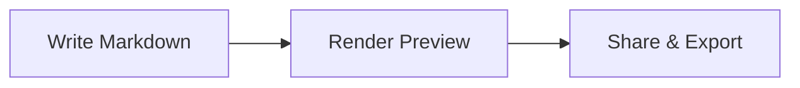

NoteApp

A modern, serverless markdown note-taking app — built for speed, privacy, and power.

NoteApp runs entirely in your browser. Your notes are stored locally in [IndexedDB](https://developer.mozilla.org/en-US/docs/Web/API/IndexedDB_API) — no servers, no accounts, no tracking. Install it as a PWA and use it offline.

---

## Features

### Editor
- **CodeMirror 6** — Modern code editor with markdown syntax highlighting
- **GitHub-style shortcuts** — `Ctrl+B` bold, `Ctrl+I` italic, `Ctrl+K` link, `Ctrl+E` code, `Ctrl+S` save
- **Paste-as-Markdown** — Copy content from any webpage; it's automatically converted to clean Markdown
- **Image support** — Paste, drag-and-drop, or upload images; stored in browser storage
- **Auto-close brackets** — Quotes, brackets, and backticks auto-pair
- **Autosave** — Changes saved automatically every 3 seconds
- **Split preview** — Side-by-side editor and rendered preview
- **Inline preview** — Toggle between writing and preview modes
- **Dark mode editor** — Full OneDark theme for CodeMirror
- **Word & character count** — Live count in the status bar

### Rendering
- **GitHub Flavored Markdown** — Tables, task lists, strikethrough, emoji
- **Mermaid diagrams** — Flowcharts, sequence diagrams, Gantt charts, mind maps, and more
- **Syntax highlighting** — Code blocks with language-aware coloring (GitHub Dark in dark mode)
- **Anchor navigation** — Click any heading link in a table of contents to scroll to that section
- **Copy code blocks** — One-click copy button on every code block (excluded from text selection)

### Organization
- **Pin notes** — Pin up to 10 important notes to the top (click or drag-to-pin)
- **Sort** — By title (A-Z, Z-A), created date, modified date, or manual drag-to-reorder
- **Full-text search** — Searches title, body, and tags simultaneously
- **Tags** — Add tags to notes; type a tag + Enter to add, Backspace to remove
- **Note metadata** — Created and modified timestamps shown on each note

### Workspaces
- **Multiple databases** — Create separate workspaces (Work, Personal, Archive)
- **Switch workspaces** — Each workspace has its own isolated set of notes and images
- **Rename & delete** — Manage workspaces from the switcher modal

### Import & Export
- **Upload** — Import single `.md` files
- **ZIP import** — Bulk import from `.zip` archives
- **ZIP backup** — Download all notes as a `.zip` archive
- **Download** — Export individual notes as `.md` files
- **Print / PDF** — Clean print layout with page-break-aware formatting

### App
- **Dark / Light mode** — App-wide theme toggle, persisted across sessions
- **PWA installable** — Add to home screen on mobile or desktop
- **Offline support** — Service worker caches the app for offline use
- **URL routing** — Each note has a shareable URL (`#note/my-note-title`)
- **Deep linking** — Link directly to a heading within a note (`#note/my-note/section`)
- **Browser navigation** — Back/forward buttons navigate between notes
- **Responsive** — Sidebar collapses to a drawer on mobile screens
- **Keyboard navigation** — Arrow keys, Enter, Space to navigate the note list
- **Accessible** — ARIA landmarks, labels, roles, and live regions throughout

---

## Keyboard Shortcuts

| Shortcut | Action |
|----------|--------|
| `Ctrl/Cmd + B` | Bold |
| `Ctrl/Cmd + I` | Italic |
| `Ctrl/Cmd + K` | Insert link |
| `Ctrl/Cmd + E` | Inline code |
| `Ctrl/Cmd + S` | Save note |
| `Ctrl/Cmd + Shift + K` | Code block |
| `Ctrl/Cmd + Shift + .` | Blockquote |
| `Ctrl/Cmd + Shift + 7` | Ordered list |
| `Ctrl/Cmd + Shift + 8` | Bullet list |
| `Ctrl/Cmd + Z` | Undo |
| `Ctrl/Cmd + Y` | Redo |
| `Ctrl/Cmd + F` | Find in editor |
| `Tab` | Indent |
| `Arrow Up/Down` | Navigate note list |
| `Enter / Space` | Open selected note |

---

## Mermaid Diagrams

Write diagrams in Markdown using fenced code blocks with the `mermaid` language:

````

````

Supports: flowchart, sequence, class, state, ER, Gantt, pie, mindmap, timeline, quadrant, and more.

---

## Markdown Syntax

### Text Formatting

```
**bold** _italic_ ~~strikethrough~~ `inline code`
```

### Headings

```
# Heading 1
## Heading 2
### Heading 3
```

### Lists

```
- Bullet item
- Another item

1. Numbered item
2. Another item

- [ ] Task to do
- [x] Task done
```

### Links & Images

```
[Link text](https://example.com)

```

### Blockquotes

```
> This is a blockquote
```

### Tables

```
| Header 1 | Header 2 |
| -------- | -------- |
| Cell 1   | Cell 2   |
```

### Code Blocks

````
```javascript
function hello() {
  console.log("Hello, world!");
}
```
````

### Horizontal Rule

```
---
```

### Emoji

Type emoji shortcodes: `:fire:` :fire: `:rocket:` :rocket: `:star:` :star: `:heart:` :heart:

---

## Tech Stack

| Layer | Technology |
|-------|-----------|
| Editor | CodeMirror 6 |
| UI Icons | Lucide React |
| Markdown | markdown-it + plugins (emoji, task lists, anchors) |
| HTML→MD | Turndown + GFM plugin |
| Diagrams | Mermaid |
| Syntax | highlight.js |
| Storage | IndexedDB (via idb) |
| Sanitization | DOMPurify |
| Build | Create React App |
| Deploy | GitHub Pages + GitHub Actions |

---

Built with :heart: — no servers, no accounts, your data stays yours.
