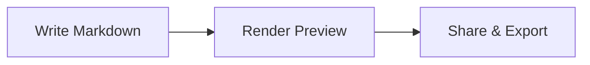
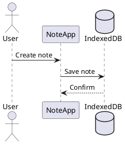

NoteApp

A modern, serverless markdown note-taking app — built for speed, privacy, and power.

NoteApp runs entirely in your browser. Your notes are stored locally in [IndexedDB](https://developer.mozilla.org/en-US/docs/Web/API/IndexedDB_API) — no servers, no accounts, no tracking. Install it as a PWA and use it offline.

---

## Features

### Editor
- **CodeMirror 6** — Modern code editor with markdown syntax highlighting and OneDark theme
- **Rich toolbar** — 18+ formatting buttons: headings, bold, italic, strikethrough, code, links, images, lists, tables, blockquotes, horizontal rules, indent/outdent
- **GitHub-style shortcuts** — `Ctrl+B` bold, `Ctrl+I` italic, `Ctrl+K` link, `Ctrl+E` code, `Ctrl+S` save, and more
- **Slash command palette** — Type `/` to open an insertion menu with formatting commands, diagrams, math blocks, and saved templates — like Notion
- **Paste-as-Markdown** — Rich HTML from webpages is automatically converted to clean Markdown, with Zendesk-specific fixes for nested lists and formatting
- **Image support** — Paste, drag-and-drop, or upload images; stored as blobs in IndexedDB
- **Language-aware code blocks** — Toolbar dropdown with 40+ languages for fenced code block insertion
- **Auto-close brackets** — Quotes, brackets, and backticks auto-pair
- **Autosave** — Toggleable 3-second debounced autosave, controlled from Settings
- **Split preview** — Resizable side-by-side editor and rendered preview
- **Inline preview** — Full rendered preview toggle
- **Vim keybindings** — Optional Vim-style editing mode, toggled in Settings
- **Vim status line** — Live mode indicator (`--NORMAL--`, `--INSERT--`, `--VISUAL--`, `--REPLACE--`) displayed in the editor status bar when Vim mode is active
- **Visual table editor** — Grid-based table editing overlay: add/remove rows and columns, cycle column alignment (left/center/right), Tab/Shift+Tab cell navigation, and Enter/Escape to save or cancel — works on existing tables or creates new ones from the toolbar
- **Note link autocomplete** — Type `[[` in the editor to trigger fuzzy autocomplete of note titles across the current workspace; selecting a suggestion inserts a `[[Note Title]]` wiki link
- **Word & character count** — Live counters in the status bar
- **Unsaved changes guard** — Save/Discard/Keep Editing dialog when navigating away or switching to Settings/Table Converter
- **Empty note protection** — Prevents saving empty notes; Save button disabled without title or body

### Rendering
- **GitHub Flavored Markdown** — Tables, task lists, strikethrough, emoji shortcodes
- **Syntax highlighting** — Code blocks with language-aware coloring via highlight.js, with language labels and auto-detection
- **Mermaid diagrams** — Flowcharts, sequence diagrams, Gantt charts, class diagrams, state diagrams, pie charts, mindmaps, timelines, and more
- **PlantUML diagrams** — Sequence diagrams, class diagrams, and more rendered via PlantUML server
- **KaTeX math** — Inline `$E=mc^2$` and block `$$...$$` equation rendering
- **Footnotes** — `[^1]` reference footnotes with superscript links and backref navigation
- **Wiki-style note linking** — `[[note title]]` creates clickable links that navigate to matching notes in the workspace
- **Backlinks panel** — Each note displays a collapsible panel showing all other notes that reference it via `[[wiki links]]`, with context snippets and one-click navigation
- **Anchor navigation** — Click any heading link to scroll smoothly; URL updates to reflect position
- **Copy code blocks** — One-click copy button on every code block with language labels
- **Nested lists** — Proper marker styles at each nesting level (disc → circle → square, decimal → lower-alpha → lower-roman)

### Templates & Zendesk
- **Snippet/Template system** — Save reusable response templates with CRUD management in Settings
- **4 default Zendesk templates** — Greeting, Escalation, Closure, Follow Up — ready to use
- **Variable expansion** — `{{customer_name}}`, `{{ticket_id}}` placeholders prompt a fill-in dialog on insert
- **Slash command templates** — Templates appear in the `/` menu alongside formatting commands
- **Copy as Rich HTML** — Single Copy button copies both rich HTML (for Zendesk paste) and plain markdown to clipboard
- **Zendesk paste fixes** — Custom Turndown rules for Zendesk HTML quirks: div/span wrappers in list items, br handling, empty paragraphs

### Tags & Intelligence
- **Tags** — Add, remove, and display tags as badges on notes
- **Tag search** — Filter notes by tag with `tag:` prefix
- **Smart tag suggestions** — AI-powered tag extraction from note content using 30 topic categories and 400+ keywords covering GitHub support, dev engineering, and tech domains (toggleable in Settings)
- **Tech pattern recognition** — Detects code languages from fenced blocks, CamelCase/snake_case splitting, heading word extraction, and frequency-based ranking

### Organization
- **Pin notes** — Pin important notes to the top (max 10 per workspace); click or drag-to-pin
- **Pinned section** — Only visible when pinned notes exist; drag notes between sections to pin/unpin
- **Sort** — By title (A-Z, Z-A), created date, modified date, or manual drag-to-reorder
- **Fuzzy search** — Fuse.js-powered search with weighted scoring across title (0.4), body (0.3), and tags (0.3), with `title:`, `body:`, `tag:` scope prefixes
- **Cached search index** — Fuse.js instances (default + 3 prefix-scoped variants) are cached and rebuilt only when notes change, eliminating per-keystroke index creation for instant results
- **Find & Replace** — In-editor search panel (Ctrl/Cmd+F to find, Ctrl/Cmd+H to replace) with match highlighting, regex support, and case-sensitive toggle — powered by CodeMirror's built-in search extension
- **Note metadata** — Created and modified timestamps displayed on each note
- **Drag & drop reorder** — Manual ordering with visual drag handles and drop zone feedback
- **Keyboard navigation** — Arrow keys, Enter, Space to navigate and select notes in the list

### Version History
- **Auto-snapshots** — Every save creates a version snapshot stored in IndexedDB
- **Version browser** — Clock icon in note toolbar opens a split-panel history viewer
- **Side-by-side preview** — Select any version to see its full rendered markdown preview
- **Diff summaries** — See character count changes and title modifications between versions
- **One-click restore** — Restore any version with automatic safety snapshot of current state
- **Auto-pruning** — Keeps up to 50 versions per note to manage storage

### Workspaces
- **Multiple databases** — Create isolated workspaces (Work, Personal, etc.) with separate IndexedDB stores
- **Workspace management** — Create, rename, delete, and switch workspaces from Settings
- **Move notes** — Move a note from one workspace to another via toolbar button

### Archive
- **Archive instead of delete** — Choose to archive notes rather than permanently delete them
- **Workspace-scoped archive** — Archive view defaults to showing notes from the current workspace, with an "All workspaces" toggle to see everything
- **Archive management** — Browse, restore, and permanently delete archived notes from Settings > Archive
- **Purge archive** — Bulk delete archived notes for the current workspace or all workspaces
- **Archive metadata** — Tracks source workspace and archive timestamp

### Settings
- **Tabbed interface** — General, Workspaces, Data & Archive, Archive, Templates, Tags, and Sync tabs
- **General** — Dark mode, auto-save, tag suggestions, Vim keybindings, and profile name
- **Workspaces** — Full workspace CRUD with inline rename and default workspace selection
- **Data & Archive** — Backup, Restore, and Import Notes sections with compact row layout; full backup/restore, Gist import, Google Drive restore, and Danger Zone
- **Workspace-scoped data** — "All workspaces" toggle on backup to export across all workspaces in a single archive
- **Full backup format** — Exports include notes, templates, tags, version history, images, pins, and settings (excluding credentials)
- **Templates** — Create, edit, delete response templates with category filtering
- **Danger Zone** — Purge current workspace or delete all workspaces (with confirmation dialogs)

### Table Converter
- **6 formats** — Convert between CSV, TSV, Markdown, HTML, SQL, and JSON
- **Auto-detect** — Automatically identifies the input table format
- **Full-page mode** — Dedicated table converter view toggled from the sidebar
- **Editor modal** — Quick-convert tables inline while editing a note
- **Format tabs** — Switch output format with tab buttons

### Import & Export
- **Full backup** — Export all workspace data (notes, templates, tags, version history, images, pins, settings) as a single .zip archive — excluding credentials
- **All-workspaces export** — Toggle "All workspaces" to create a unified backup of every workspace in one archive
- **Full restore** — Import a full backup .zip to restore all data stores; auto-detects single-workspace vs multi-workspace format
- **Import from Gist** — Import markdown notes from any GitHub Gist by pasting a URL or ID; public gists work without authentication, private gists use the configured token
- **Upload** — Import single `.md` files
- **ZIP import** — Bulk import from legacy `.zip` archives (notes + optional metadata)
- **ZIP backup** — Download all notes as a `.zip` archive
- **Download** — Export individual notes as `.md` files
- **Print / PDF** — Clean print layout with page-break-aware formatting; use browser "Save as PDF"

### GitHub Gist Sync
- **Cross-device sync** — Sync notes to a private GitHub Gist for backup and multi-device access
- **Auto-sync** — Background push after every save (10-second debounce)
- **Configurable sync interval** — Set automatic background sync to 1, 5, 15, or 30 minutes from Settings; interval pauses when the tab is hidden and resumes on focus
- **Bidirectional merge** — Pull + merge + push with newest-wins per-note conflict resolution
- **Full sync on demand** — One-click "Sync Now" from the command palette or settings triggers a complete bidirectional sync
- **Token-based auth** — GitHub Personal Access Token with `gist` scope only
- **Per-workspace Gists** — Each workspace syncs to its own private Gist
- **Link existing Gist** — Connect another device by pasting the Gist ID
- **Live sync status** — Header indicator shows sync state (idle/syncing/success/error) with relative timestamps ("just now", "5m ago"), spinner animation, and color-coded feedback
- **Auto-sync on reconnect** — Automatically triggers a full sync when the browser comes back online
- **Privacy** — Notes stored as JSON in your own GitHub account; no third-party servers

### Google Drive Backup
- **One-click backup** — Back up all workspace notes to Google Drive with a single button click
- **Session-aware authorization** — Uses Google Identity Services (GIS) Token Model; if already signed into Google in the browser, the consent popup pre-fills the account — just click "Allow"
- **Client-side only** — No backend server required; OAuth tokens are managed per-session in the browser
- **Private storage** — Notes are stored in Drive's hidden `appDataFolder`, invisible in the user's normal Drive UI
- **Restore from Drive** — Download and restore notes from the most recent Google Drive backup
- **Per-workspace backups** — Each backup records the workspace name and export timestamp
- **Configurable** — Requires a free Google Cloud OAuth Client ID (one-time setup in Settings > Sync)

### App
- **Dark / Light mode** — Full theme toggle with GitHub-style syntax highlighting in both modes
- **PWA installable** — Add to home screen on mobile or desktop
- **Offline support** — Service worker (v3) with network-first navigation and cache-first static assets (JS, CSS, fonts, SVGs)
- **Offline banner** — Visual indicator when the app is offline, with automatic dismissal on reconnect
- **App update banner** — Detects new service worker versions and prompts to reload with one click; controlled `skipWaiting` for safe updates
- **URL routing** — Each note has a shareable URL (`#note/my-note-title`)
- **Deep linking** — Link directly to a heading within a note (`#note/my-note/section`)
- **Browser navigation** — Back/forward buttons navigate between notes
- **Responsive** — Collapsible and resizable sidebar; drawer mode on mobile with overlay
- **Accessible** — ARIA landmarks, labels, roles, live regions, and focus management throughout
- **Error boundary** — Graceful error handling with recovery UI
- **XSS protection** — All rendered HTML sanitized with DOMPurify

### Sidebar
- **Page toggles** — Table Converter and Settings icons on the left (page navigation)
- **Action buttons** — Search and New Note on the right (tools)
- **Import Note submenu** — Hamburger menu "Import Note" item with flyout: "From File" (.md upload) and "From Gist" (opens URL dialog)
- **Collapsed mode** — Compact vertical icon strip with full functionality
- **Visual harmony** — Aligned bar heights (44px header, 36px actions) matching main content

---

## Keyboard Shortcuts

| Shortcut | Action |
|----------|--------|
| `Ctrl/Cmd + B` | Bold |
| `Ctrl/Cmd + I` | Italic |
| `Ctrl/Cmd + K` | Insert link |
| `Ctrl/Cmd + E` | Inline code |
| `Ctrl/Cmd + S` | Save note |
| `Ctrl/Cmd + Shift + K` | Code block |
| `Ctrl/Cmd + Shift + .` | Blockquote |
| `Ctrl/Cmd + Shift + 7` | Ordered list |
| `Ctrl/Cmd + Shift + 8` | Bullet list |
| `Ctrl/Cmd + Z` | Undo |
| `Ctrl/Cmd + Y` | Redo |
| `Ctrl/Cmd + F` | Find in editor |
| `Ctrl/Cmd + H` | Find & Replace in editor |
| `Ctrl/Cmd + P` | Quick Switcher — fuzzy search and jump to any note |
| `Ctrl/Cmd + Shift + P` | Command Palette — access 11 app commands with shortcuts |
| `Ctrl/Cmd + N` | Create new note |
| `Tab` | Indent |
| `Arrow Up/Down` | Navigate note list |
| `Enter / Space` | Open selected note |

---

## Quick Switcher & Command Palette

**Quick Switcher** (`Cmd/Ctrl + P`) — Fuzzy-search note titles and tags to instantly jump to any note. Shows recent notes when the query is empty, with a body preview for each result. Navigate with arrow keys, select with Enter, dismiss with Escape.

**Command Palette** (`Cmd/Ctrl + Shift + P`) — Access app-wide actions: create note, search, toggle dark mode, toggle sidebar, open settings, export, delete, sync, and more. Each command shows its keyboard shortcut. Filter by typing.

---

## Search Syntax

| Query | What It Searches |
|-------|-----------------|
| `react hooks` | Fuzzy match across title + body + tags (ranked) |
| `title:meeting` | Title only |
| `body:TODO` | Body content only |
| `tag:projectx` | Tags only |

Powered by Fuse.js — typo-tolerant fuzzy matching with weighted scoring.

---

## Mermaid Diagrams

Write diagrams in Markdown using fenced code blocks with the `mermaid` language:

````

````

Supports: flowchart, sequence, class, state, ER, Gantt, pie, mindmap, timeline, quadrant, and more.

---

## PlantUML Diagrams

Write PlantUML diagrams in fenced code blocks with the `plantuml` language:

````

````

Rendered via the public PlantUML server.

---

## Math (KaTeX)

Inline math: `$E = mc^2$` renders as $E = mc^2$

Block math:
```
$$
\int_0^\infty e^{-x^2} dx = \frac{\sqrt{\pi}}{2}
$$
```

---

## Footnotes

```
This claim needs a source[^1].

[^1]: Source: Example Research Paper, 2024
```

Footnotes render as superscript links with a numbered reference section at the bottom.

---

## Wiki Links

Link between notes using double-bracket syntax:

```
See [[My Other Note]] for details.
```

Clicking a wiki link navigates to the matching note in the current workspace.

---

## Templates & Variables

Create reusable templates in Settings > Templates. Templates support `{{variable}}` placeholders:

```
Hi {{customer_name}},

Thank you for reaching out regarding {{ticket_id}}.
```

Insert via the `/` slash command menu. Variables prompt a fill-in dialog on insert.

---

## Markdown Syntax

### Text Formatting

```
**bold** _italic_ ~~strikethrough~~ `inline code`
```

### Headings

```
# Heading 1
## Heading 2
### Heading 3
```

### Lists

```
- Bullet item
- Another item

1. Numbered item
2. Another item

- [ ] Task to do
- [x] Task done
```

### Links & Images

```
[Link text](https://example.com)

```

### Blockquotes

```
> This is a blockquote
```

### Tables

```
| Header 1 | Header 2 |
| -------- | -------- |
| Cell 1   | Cell 2   |
```

### Code Blocks

````
```javascript
function hello() {
  console.log("Hello, world!");
}
```
````

### Horizontal Rule

```
---
```

### Emoji

Type emoji shortcodes: `:fire:` :fire: `:rocket:` :rocket: `:star:` :star: `:heart:` :heart:

---

## Tech Stack

| Layer | Technology |
|-------|-----------|
| Editor | CodeMirror 6 (+ Vim mode via @replit/codemirror-vim) |
| UI Icons | Lucide React |
| Markdown | markdown-it + plugins (emoji, task lists, anchors, footnotes, KaTeX) |
| HTML→MD | Turndown + GFM plugin |
| Diagrams | Mermaid + PlantUML |
| Syntax | highlight.js (GitHub Light + Dark themes) |
| Math | KaTeX |
| Search | Fuse.js (fuzzy search) |
| Storage | IndexedDB (via idb) + localStorage |
| Cloud Backup | Google Drive API (appDataFolder via GIS Token Model) |
| Sanitization | DOMPurify |
| Build | Create React App |
| Deploy | GitHub Pages |

---

Built with :heart: — no servers, no accounts, your data stays yours.
